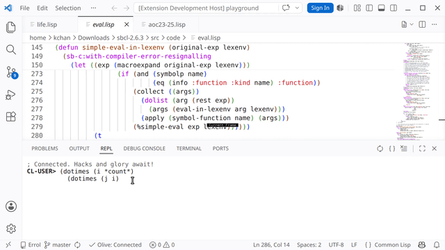
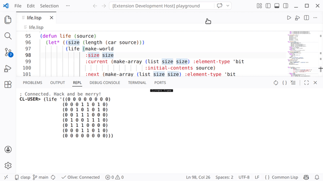
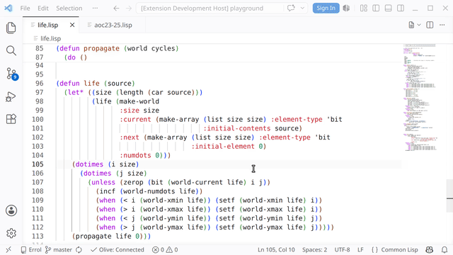

# OLIVE: Old-school LIsp Vscode Extension

You need to install a Common Lisp implementation. For new comers, [SBCL](https://www.sbcl.org) is recommended. Other popular implementations include [CCL](https://ccl.clozure.com) and [ECL](https://ecl.common-lisp.dev/). You need to configure `olive.lispCommand` for implementations other than SBCL. It is also recommended (but optional) to install [Quicklisp](https://quicklisp.org) package manager and configure the [Ultralisp](https://ultralisp.org) distribution.

## REPL and Debugger

The REPL is in the bottom panel. Multi-line input works, `Enter` sends the input when it's completed (all parenthesis are balanced). Input history is accessed via `Alt+Up/Down`. The sync button on the top right of the panel attempt to set current package and directory according to the opened file in the editor. If a debugger pop up saying the package does not exist, you probably haven't load the file or system yet -- read further.

You will quite often have the debugger popped up. `ABORT` is bound to key `A` and `CONTINUE` is bound to key `C`, so you can press `A` to dismiss (abort) it. Number keys are also bound to restarts in order. Clicking the stack frames jump to the source, shows local variables, and some other useful actions.

`Ctrl/Cmd+Shift+R` starts a new Lisp process, or restarts it if one is already running. Clicking the "OLIVE" status bar item has the same effect. Use it in case the state of your Lisp image stops making sense. Be aware you need to load your files/systems into the freshly restarted process again to resume working on them.

OLIVE automatically starts a Lisp process when it is activated, this behavior can be disabled with the `olive.autostart` configuration. Note that many functionalities (accurate indentation, go to definition, hover...) rely on a running Lisp process.

## Structural Editing

This is one of the essential and unique feature of Lisp environments. The built-in structural editing functionalities of OLIVE aims to support basic operations first. If you wish to use another structural editing plugin, you can disable it with the `olive.structuralEditing` configuration. The key bindings are generally similiar to other Paredit ports on VSCode. What is currently implemented:

- Navigation: Backward Sexp (`Ctrl+Left` win/linux `Alt+Left` mac), Forward Sexp (`Ctrl/Alt+Right`), Forward Down Sexp (`Ctrl+Down`), Backward Up Sexp (`Ctrl+Up`), Forward Up Sexp (`Ctrl+Alt+Down`).
- Selection: When holding down `Shift`, the navigation commands become selection commands that move selection.
- Strict Mode: Enabled by default, configure via `olive.strictMode`.
- Editing: Slurp Forward (`Ctrl+Alt+Right` win/mac `Ctrl+Alt+.` linux), Barf Forward (`Ctrl+Alt+Left` win/mac `Ctrl+Alt+,` linux), Slurp Backward (`Ctrl+Alt+Shift+Left`), Barf Backward (`Ctrl+Alt+Shift+Right`), Splice Sexp (`Ctrl+Alt+S`), Split Sexp (`Ctrl+Shift+S`), Wrap `()` Around (`Ctrl+Alt+P`), Raise Sexp (`Ctrl+Alt+R`), Forward Kill Sexp (`Ctrl+Delete` win/linux `Alt+Delete` mac), Backward Kill Sexp (`Ctrl/Alt+Backspace`), Forward Splice Kill (`Ctrl+Alt+Shift+Delete`), Backward Splice Kill (`Ctrl+Alt+Shift+Backspace`).

## Loading Files and Systems

The play button (also key `F5`) on the top right of the editor window compiles and loads the current file. This compiles with default settings, which has good performance and is already debuggable. More options are available in the drop down menu next to it: High debug settings (also key `Shift+F5`), if you hate some compiler optimizations (variable elimination, stack frame elision...); Load directly (also key `Alt+F5`), this one is equivalent to entering forms in the file into REPL one by one, generally more useful for scripting.

`Shift+Enter` evaluates the expression before it and display the result.

`Ctrl/Cmd+Enter` compiles the current top-level form (i.e. surrounding or before the cursor). This is particularly useful for defining functions one by one. `Ctrl/Cmd+Shift+Enter` compiles the current top-level form with high debug settings. `Ctrl/Cmd+Alt+Enter` evaluates the current top-level form without compiling. All these actions are accessible from right-click menu.

Most Lisp projects use the [ASDF](https://asdf.common-lisp.dev/) build system. `Ctrl/Cmd+Shift+L` tries to find a system definition (`.asd`) file under workspace root and load the system. This is handy for loading or reloading all Lisp files in your project and dependencies, after you wrote a working `.asd` file ([tutorial](https://lispcookbook.github.io/cl-cookbook/systems.html)).

## Exploring functions and macros

Unlike many other programming systems, the full source code and reference information for all the libraries and often the Lisp implementation itself (if you compiled SBCL from source) are always available. You can expect `F12` (Go To Definition) to demystify everything you see! Reference commands like `Shift+F12` (Peek References) also work.

OLIVE also comes with a macro stepper (inspired by Emacs [macrostep](https://github.com/emacsorphanage/macrostep)). You can press `Ctrl/Cmd+Shift+E` or use "Expand Macro" in the right-click menu to expand a macro form. You can step through the expansion using either keyboard shortcuts (`E` for expansion, `C` for collapse), double click (clicking the link expands, clicking other places collapses), or right-click menu.

