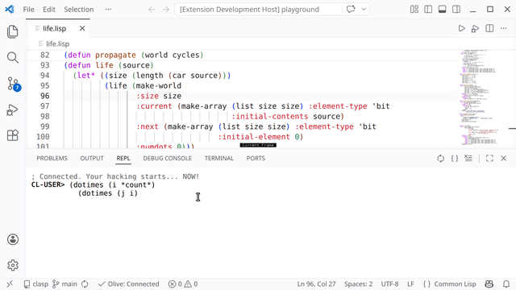
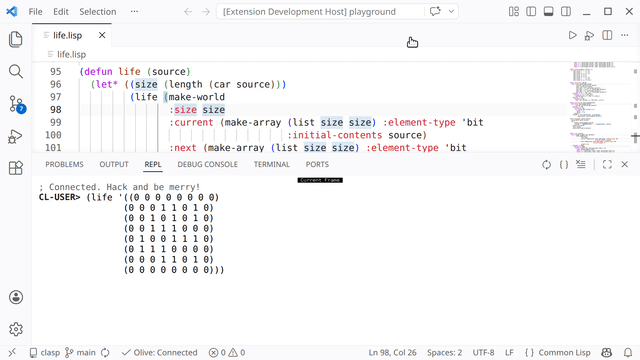

#+TITLE:OLIVE: Old-school LIsp Vscode Extension
* REPL and Debugger
The REPL is in the bottom panel. Multi-line input works, ~Enter~ sends the input when it's completed (all parenthesis are balanced). The sync button on the top right of the panel attempt to set current package and directory according to the opened file in the editor. If a debugger pop up saying the package does not exist, you probably haven't load the file or system yet -- read further.

You will quite often have the debugger popped up. ~ABORT~ is bound to key ~A~ and ~CONTINUE~ is bound to key ~C~, so you can press ~A~ to dismiss (abort) it. Number keys are also bound to restarts in order.

~Ctrl/Cmd+Shift+R~ starts a new Lisp process, or restarts it if one is already running. Clicking the "Olive" status bar item has the same effect. Use it in case the state of your Lisp image stops making sense. Be aware you need to load your files/systems into the freshly restarted process again to resume working on them.
* Loading Files and Systems
The play button (also key ~F5~) on the top right of the editor window compiles and loads the current file. This compiles with default settings, which has good performance and is already debuggable. However, if you hate some compiler optimizations (variable elimination, stack frame elision...), you can click the play button /with bug/ (also key ~Shift+F5~) to compile and load with high debug settings.

Most Lisp projects use the [[https://asdf.common-lisp.dev/][ASDF]] build system. ~Ctrl/Cmd+Shift+L~ tries to find a system definition (~.asd~) file under workspace root and load the system. This is handy for loading or reloading all Lisp files in your project and dependencies, after you wrote a working ~.asd~ file ([[https://lispcookbook.github.io/cl-cookbook/systems.html][tutorial]]).
